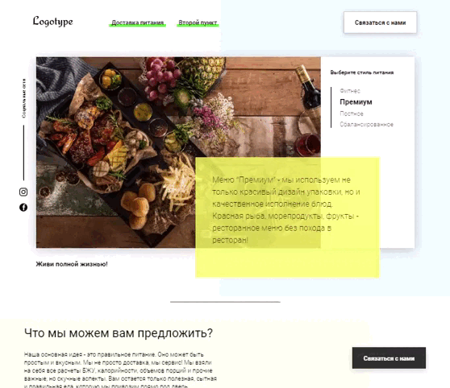

# FoodProjectStudy (Учебный проект)

**Функционал проекта**:  
- Сайт с заказом еды 
- Карточки 
- Табы 
- Слайдер 
- Калькулятор калорий 
- Модальное окно 
- Таймер скидки 

**Используемые технологии**: 
- HTML 
- CSS 
- JavaScript 

**Изображение**: 

